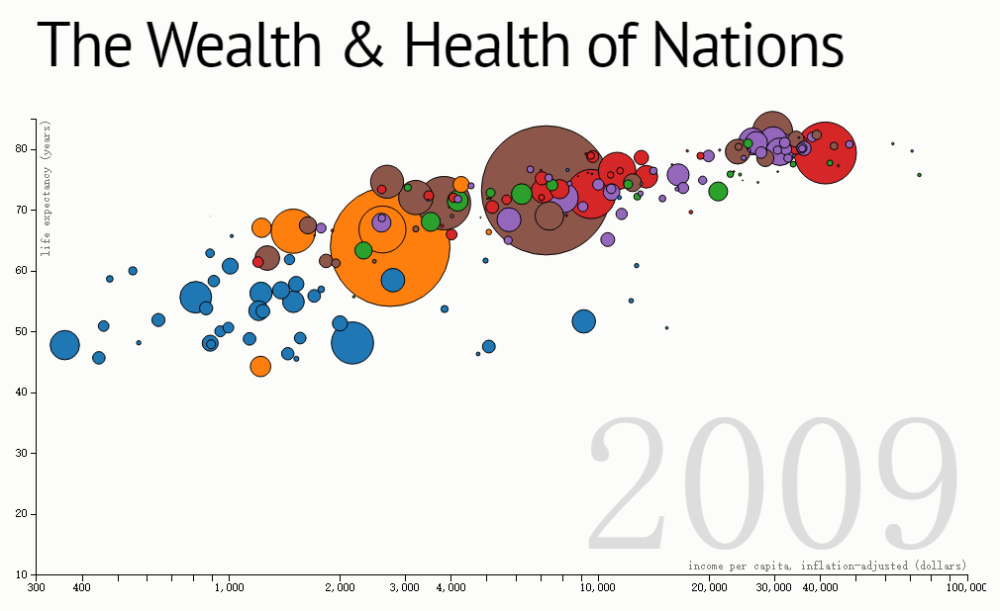

0.Title
========
这次演讲的内容是`D3.js数据可视化`，开始我会简单介绍下数据可视化，然后推出数据可视化工具，也是我们要学习和交流的主角——D3.js，最后说下对将要建立的D3社区的展望。

1.数据可视化
===========
我接触D3是因为公司部门想要为现有的平台增加BI系统和监控系统的一些功能，因为其中的一些研究涉及到比较专业的数据分析，所以综合考虑，选择了
D3。`BI商业智能` `监控系统` `科学研究`

随着数据工具的成熟，最近几年大数据的概念很火，很多企业都在关注数据分析。在海量的数据面前，数据分析师不管是进行数据分析，还是向上层呈现分析过程和报告，使用图形图表也都是很必要的。`数据分析` `数据展示`

而我们身边呢，各种软件产品越来越方便人们的生活，比如地图、股票、天气趋势、新闻数据等等。`数据展示`

这里是一些例子，[各种图片、图表、地址]

数据可视化的优点
-----------------

那么数据可视化有哪些优点呢？我从一些例子中找出了很多的优点，但归结为一个词，也就是——**直观**。

直观就是，看一眼，就看到了全部。

直观的基础是数据多维度的展现。我们可以从这个例子[The Wealth & Health of Nations](http://bost.ocks.org/mike/nations/)中窥出一些，

这个图表我并未了解其具体含义（想要了解的可以看文中介绍的TED演讲），大概说的是各国家财富和健康的关系。从图表中我们可以找到几个维度呢？

* 圆形，国家
* x轴，人均收入
* y轴，寿命
* 圆形大小，人口总量
* 圆形颜色，洲
* 动态/鼠标交互，年份

这个图表的数据文件大小为600k+，包括几个大洲179个国家，从1800年到2009年的所有人口总量、人均收入和寿命的数据。如此量的数据，展现成图表，真的可以尽收眼底啊。

另外，从用户鼠标滑动使年份产生变化也可以看出，图表是**可交互**的，交互也是图表维度的一个方面。

最后呢，我们从D3官网的Gallery里可以看到，可视化的形式是多种多样的，从最基本的直方图、折线图、饼图，到复杂的弦图、力导向图、地图等等等等，数据可以根据你的想法按任意方式展现。

2.D3.js
======

简介
-----
根据D3官网的描述，

> D3.js 是基于数据操作文档的JavaScript库，它可以帮助你使用HTML，SVG和CSS生动地展现数据。D3不需要你使用某个特定的框架，它的重点在于对主流浏览器的兼容，同时结合了强大的可视化组件，以数据驱动的方式去操作DOM。

历史 & 作者
-----

**Mike Bostock**

@mbostock on Github/Twitter

* 2005年，Jeff推Prefuse，JavaApplet
* 2007年，Jeff推Flare，ActionScript
* 2009年，Jeff说服Mike一起推Protovis，Javascript
* 2011年，Mike，Vadim，Jeff推D3，Javascript

具体情况，大家可以去阅读《数据可视化实战: 使用D3设计交互式图表》

项目情况
--------

关键技术 & SVG
--------

API
--------

一些概念
--------

优缺点
--------

具体应用
--------

